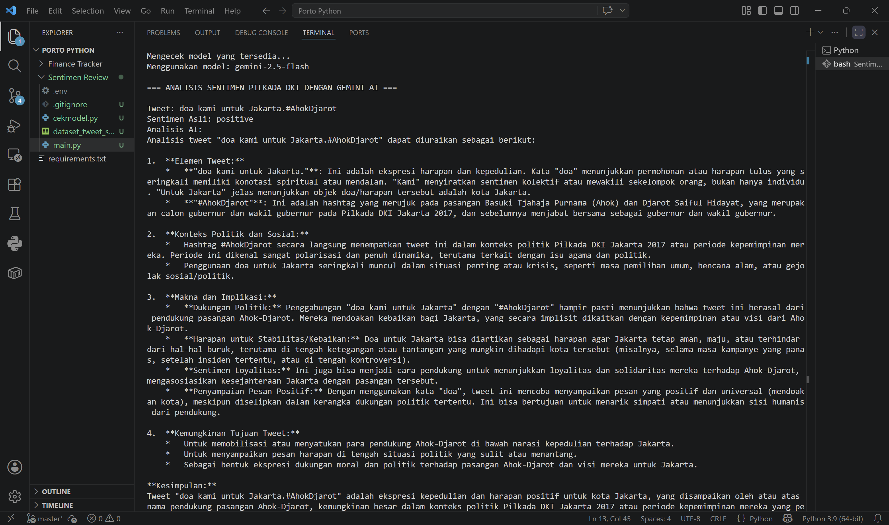

# Review-Sentiment-Analysis Pilkada DKI 2017 Menggunakan Gemini AI

Project ini melakukan analisis sentimen terhadap tweet seputar Pilkada DKI 2017 menggunakan model **Gemini 2.5 Flash**. Project ini membandingkan label sentimen asli dari dataset dengan hasil analisis AI.

## Sumber Data
Dataset yang digunakan dalam project ini berasal dari repositori:
[rizalespe/Dataset-Sentimen-Analisis-Bahasa-Indonesia](https://github.com/rizalespe/Dataset-Sentimen-Analisis-Bahasa-Indonesia)

## Fitur
- **Auto-Model Detection**: Mendeteksi secara otomatis model Gemini terbaru yang tersedia di API Key pengguna.
- **Contextual Explanation**: AI memberikan alasan di balik label sentimen yang diberikan.
- **Security**: Menggunakan standar `.env` untuk melindungi API Key.

## Cara Menjalankan
1. Clone repo ini.
2. Install library: `pip install -r requirements.txt`
3. Masukkan API Key kamu ke file `.env`.
4. Jalankan: `python main.py`

## Hasil Demo
Berikut tampilan saat program berhasil dijalankan:

